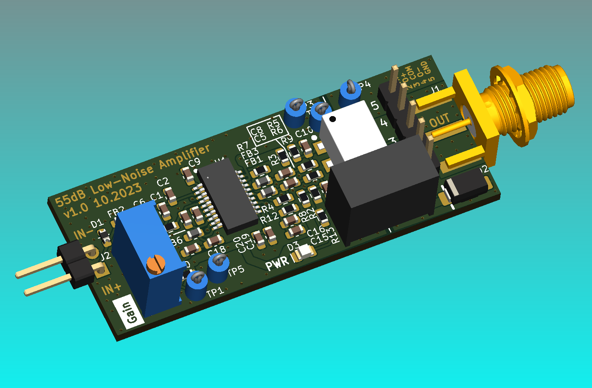

# Low-Noise Amplifier for Current Sensing

This is an experimental breakout board for the ultralow noise AD8331
variable-gain amplifier with internal low-noise preamplifier. 
The board is designed to provide electrical isolation
between the output (connects to oscilloscope) and the input port.

- AC-coupled input up to 200 mV
- Adjustable gain amplifier, up to 55 dB
- Galvanically isolated output
- Single 3.3V supply

The input impedance of the amplifier should be around 6k ohms.
The output is matched to 50 ohms over an isolating signal transformer.

The amplifier module is intended to be used as a current probe with
an additional shunt resistor. The amplifier is placed near the device 
under test and amplifies the voltage drop across the measurement resistor.
The output signal is digitized by an oscilloscope connected over the SMA connector.

## Progress

- [x] Schematics design
- [x] PCB layout
- [x] PCB prototype manufacturing
- [ ] In-circuit verification
- [ ] Proof-of-concept of power analysis side channel attack

## Motivation
The current probe is designed to measure the transient current consumption
of microcontrollers and low-end CPUs in order to use a power consumption
side channel, which can be used to leak information about cryptographic
operations.

Such side-channel attacks have been known to exists for many years, and there
are even [commercial tools](https://chipwhisperer.readthedocs.io/en/latest/getting-started.html)
available which simplify the research process.

My goal with this DIY low-noise current probe is to have a cost-effective 
alternative to other specialized tools, as I already own 
suitable measurements equipment (i.e., an oscilloscope) 
and do not need access to other attack methods (such as fault injection).

## Manufacturing
PCB manufacturing was done in a custom panel with 5 individual PCBs by
[multi-cb](multi-cb.eu). Assembly was done by hand.

## License

<a property="dct:title" rel="cc:attributionURL" href="https://github.com/stgloorious/current-probe">current-probe</a> by <a rel="cc:attributionURL dct:creator" property="cc:attributionName" href="https://github.com/stgloorious/">Stefan Gloor</a> is licensed under <a href="http://creativecommons.org/licenses/by-sa/4.0/?ref=chooser-v1" target="_blank" rel="license noopener noreferrer" style="display:inline-block;">CC BY-SA 4.0</a>

This does not include work of third parties, e.g., 3D STEP models.
